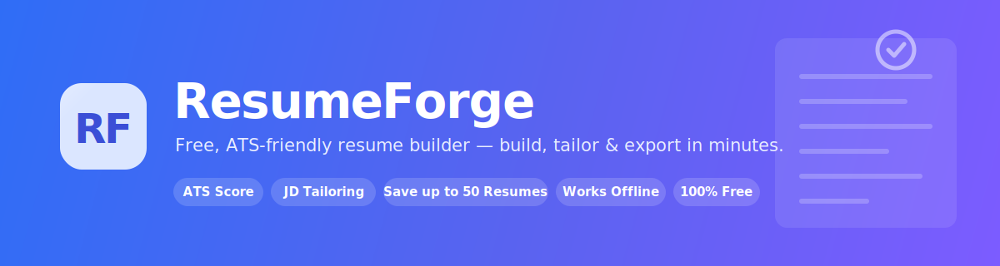
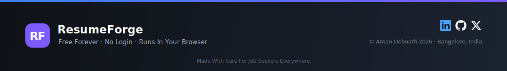

<p align="center">
  
</p>

<p align="center">
  
  
  
  
  
  
</p>

<p align="center">
  <a href="https://REPLACE-ME.pages.dev">
    
  </a>
</p>

<p align="center"><b>Build a clean, recruiter-ready, ATS-safe resume in your browser — no sign-up, no cost, nothing uploaded.</b></p>

> **Heads up — replace the placeholder links** marked `REPLACE-ME` (the live demo URL above and the social links at the bottom) with your own once you've deployed.

---

## Contents

- [What is ResumeForge](#what-is-resumeforge)
- [Quick start](#quick-start)
- [The interface](#the-interface)
- [Features](#features-a-quick-manual)
- [How to build your resume](#how-to-build-your-resume)
- [Templates and profiles](#templates-and-profiles)
- [ATS score and JD tailoring](#ats-score-and-jd-tailoring)
- [Saving, export and import](#saving-export-and-import)
- [Privacy](#privacy)
- [Deploy your own copy](#deploy-your-own-copy)
- [Project structure](#project-structure)
- [Versioning](#versioning)
- [License](#license)

---

## What is ResumeForge

ResumeForge is a free, single-page web app for writing resumes that **actually parse correctly** in Applicant Tracking Systems. You edit on the left, see an exact A4/Letter page in the middle, and get a live ATS score plus job-description tailoring on the right. The PDF you download contains **real selectable text** (not an image), so ATS bots and recruiters can read every word.

It runs entirely in your browser. No account, no server, no tracking, and it keeps working offline.

## Quick start

**Option A — just open it**

1. Download or clone this repository.
2. Double-click `index.html`. That's it.

**Option B — use the hosted version**

Visit the live link: **[ResumeForge](https://REPLACE-ME.pages.dev)** *(replace with your deployed URL)*.

## The interface

ResumeForge has three panels:

| Panel | What it does |
|-------|--------------|
| **Left - Content** | Every section of your resume, fully editable. Add, reorder (drag the grip), hide, or delete sections. |
| **Middle - Preview** | An exact A4/Letter page that updates live as you type. Zoom in/out or type an exact zoom %. |
| **Right - Analysis** | Live ATS readiness score, a fix-it checklist, and a "Tailor to JD" tab to match a job description. |

On narrow screens the three panels collapse into an **Edit / Preview / ATS** switcher.

## Features (a quick manual)

**Writing**
- Inline editor for every section: summary, experience, education, projects, skills, and more.
- **Predefined keyword chips** for skills, languages, degrees, and job titles - plus a **Custom** input everywhere for anything not on the list.
- **Add custom sections** (entry-based or simple bullet list) via the "+ Add section" menu.
- **Drag to reorder** sections by their grip handle (arrow buttons also work).
- **Memory-foam fields**: drag-resize any text box and it stays that size - across edits, reloads, even next visit.

**Look and export**
- **4 templates**: Software Engineering (classic), UI/UX Design, Graphic Design, Researcher/Academic - all single-column and ATS-safe.
- **3 profiles** seed different starter content: Experienced, Fresher, Study Abroad.
- **A4 and Letter** page sizes.
- **Light and dark** themes (interface only; your resume stays print-clean).
- Optional **LinkedIn/GitHub icons** next to your links - coloured on colour templates, solid black on the classic one.
- **Download PDF** with real, selectable, ATS-parseable text.

**Get hired faster**
- **Live ATS score** with a prioritised checklist (missing email, no metrics, weak verbs, missing locations, and more).
- **Suggested keywords** tuned to the template you picked.
- **Tailor to JD**: paste a job description and ResumeForge extracts the **job role, location, skills, and other keywords**, shows what you already match (in green) and what's missing (one click to add).

**Save your work**
- **Up to 50 named resumes** saved locally in your browser.
- **Export / Import** any resume as a `.json` file for backups or moving between devices.
- Auto-saves your in-progress edit.

## How to build your resume

1. Pick a **Profile** (Experienced / Fresher / Study Abroad) and a **Template** in the top bar.
2. Fill in **Personal details**, then each section on the left. Use the keyword chips to add skills fast.
3. Watch the **ATS score** on the right climb as you resolve the checklist items.
4. (Optional) Open **Tailor to JD**, paste the job post, and click the suggested keywords/role/location to apply them.
5. Choose **A4** or **Letter**, then click **Download PDF**. In the print dialog keep *Margins: Default* and *Scale: 100%*, and untick *Headers and footers*.
6. Open **My Resumes** to save it with a name, or **Export** a `.json` backup.

## Templates and profiles

| Template | Best for |
|----------|----------|
| Software Engineering | The classic Overleaf single-column look (the default). |
| UI/UX Design | Sans-serif, accent section rules, portfolio-forward. |
| Graphic Design | Bold uppercase headline with a strong accent. |
| Researcher / Academic | Serif, justified, publications-first CV style. |

Switching templates keeps your content - only the styling changes.

> **More templates coming soon.**

## ATS score and JD tailoring

The score is a weighted check of the things real ATS and recruiters look for: contact details, a focused summary, experience with dates and locations, action-verb bullets, quantified results, education, and enough skills for keyword matching. Fix the red and amber items first.

For tailoring, paste the full job description in the **Tailor to JD** tab. ResumeForge runs a fully-offline keyword engine that buckets what it finds into **Job role**, **Location**, **Skills**, and **Other keywords**, marks what's already in your resume, and lets you add the rest with one click.

## Saving, export and import

Everything is stored locally in your browser (nothing leaves your machine):

- **My Resumes** -> Save, Open, Rename, Duplicate, Delete (up to 50).
- **Export** writes a `.json` file; **Import** loads one back. Use this to back up or move resumes to another browser or computer - saved resumes do not travel with the files automatically.

## Privacy

No accounts. No analytics. No network calls except loading the Inter web font (with a system-font fallback when offline). Your resume data lives only in your browser's local storage.

## Deploy your own copy

It's a static site, so hosting is free and trivial.

1. Push these files to a GitHub repo (keep the folder structure; `index.html` at the root).
2. In Cloudflare: **Workers & Pages -> Create -> Pages -> Connect to Git**, pick the repo.
3. **Framework preset:** None. **Build command:** empty. **Output directory:** `/`.
4. Deploy - you get a free `your-project.pages.dev` URL with HTTPS.

(Any static host works too: GitHub Pages, Netlify, Vercel, or just opening the file locally.)

## Project structure

```
ResumeForge/
├── index.html            App shell (top bar + 3 panels + footer)
├── css/                  base / layout / components / preview styles
├── js/
│   ├── version.js        single source of truth for the version
│   ├── keywords.js       predefined keyword dictionaries
│   ├── state.js          data model + sample data + autosave
│   ├── templates.js      the four template skins
│   ├── render.js         builds the real-text resume HTML
│   ├── jd.js             offline job-description keyword engine
│   ├── editor.js         left editor panel
│   ├── ats.js            ATS score + suggestions + JD tailoring
│   ├── pdf.js            real-text print-to-PDF
│   ├── theme.js          light / dark
│   ├── store.js          named save/load + export/import
│   └── app.js            boot + all event wiring
├── assets/               logo + README banners
├── README.md
├── CHANGELOG.md
└── LICENSE
```

## Versioning

ResumeForge follows [semantic versioning](https://semver.org): **MAJOR.MINOR.PATCH**. The current version shows in the app footer and is defined once in [`js/version.js`](js/version.js).

When you ship a change: bump `RF.VERSION` in `js/version.js` (and the `version` badge above), then add a dated entry to [`CHANGELOG.md`](CHANGELOG.md).

## License

Released under the [MIT License](LICENSE) - free to use, modify, and share.

---

<p align="center">
  
</p>

<p align="center">
  <a href="https://linkedin.com/in/REPLACE-ME"></a>
  <a href="https://github.com/REPLACE-ME"></a>
  <a href="https://x.com/REPLACE-ME"></a>
</p>

<p align="center"><sub>ResumeForge is free to use for everyone &#183; &#169; Aman Debnath 2026 &#183; Bangalore, India</sub></p>
